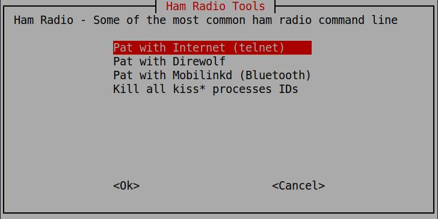

# HamConsole

Several Linux ham radio apps require multiple commandline executions.  This can be done with multiple terminals, 
or we can can Tmux with spilt screens/panes.  This is extrememly useful to:

* Run over ssh
* Run without X, but all in one tmux session
* Run on a RaspberyPi or other non X system

Here I've created a script to run the various configurations I might want to run on when in the field or at home.


## Requirements

1. tmux      Used for mutliple panes in terminal
1. whiptail  User for menu system
1. figlet    Used for title display


## Basic Use

Options are:

* Pat with Internet (telnet)
* Pat with Direwolf
* Pat with Mobilinkd (Bluetooth)
* Kill all kiss* processes IDs




## Config

`config` - File with the common variables and setting used by all the scripts


## Icon and Desktop file

For many Debian based systems, edit then copy the ham.desktop file to ~/.local/share/applications/ so you can run this from the GUI menu system.

```bash
cp ham.desktop ~/.local/share/applications/
```


### Sources:

* Ham radio icon from https://icons8.com/icons/set/ham-radio
* https://www.hamvocke.com/blog/a-quick-and-easy-guide-to-tmux/

